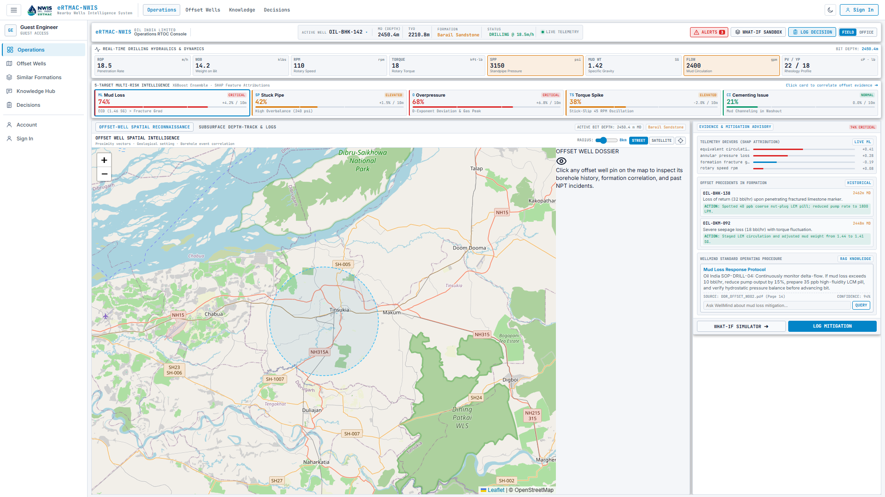
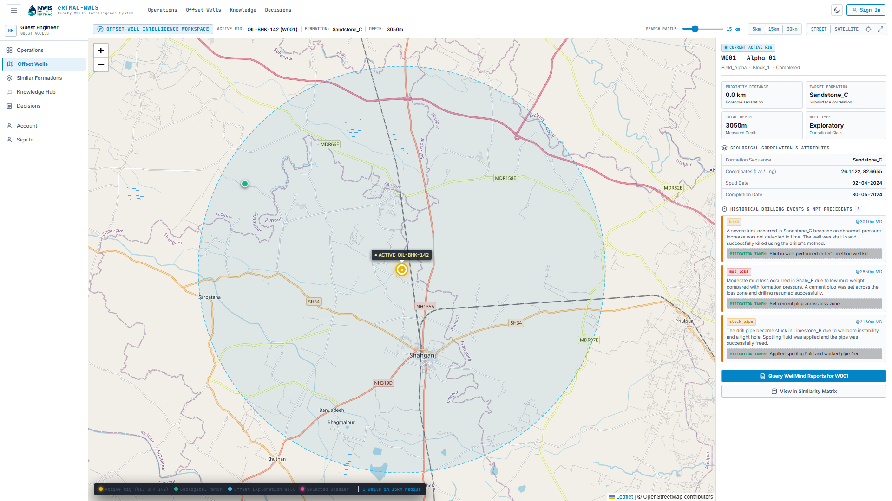
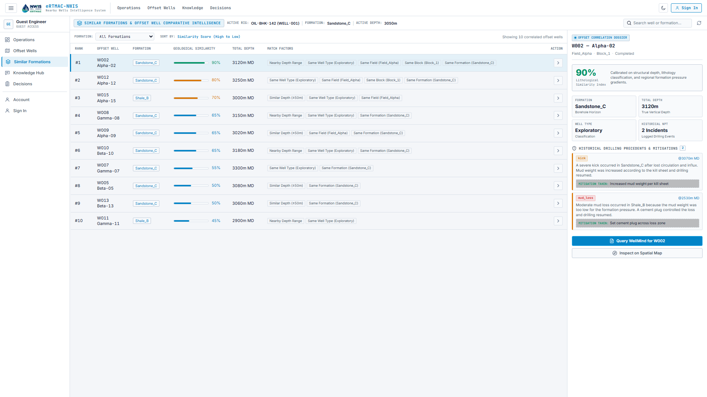
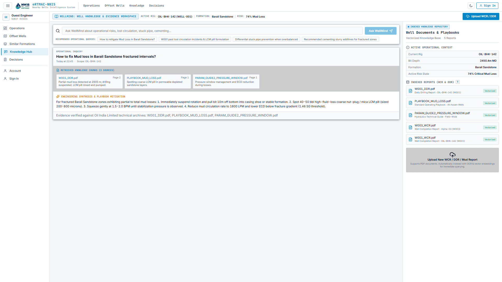
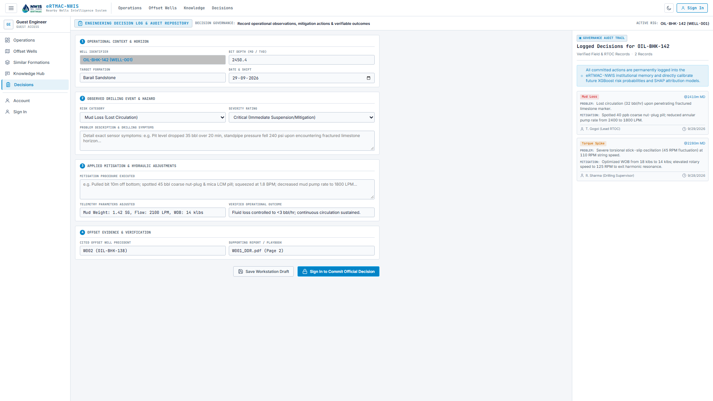
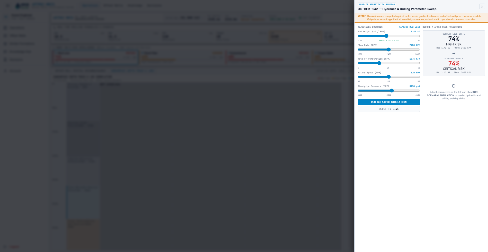
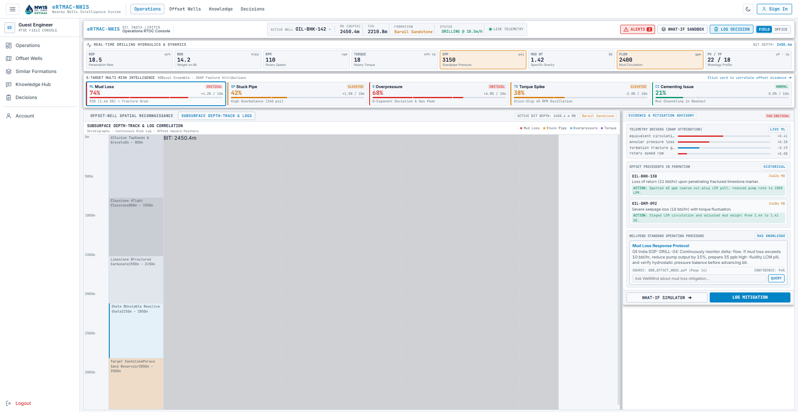
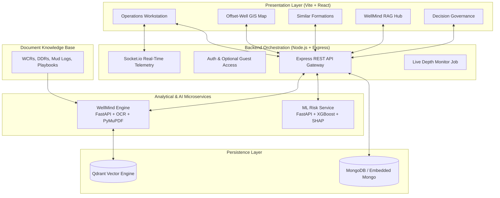

<div align="center">

# eRTMAC-NWIS
### Nearby Wells Intelligence System
**AI-Powered Offset-Well Knowledge & Operational Decision Support Platform for Drilling Operations**

Smart India Hackathon 2026 · Problem Statement `SIH26121` · Oil India Limited

[](https://ertmac-nwis-frontend.onrender.com/)
[](https://github.com/Sathwik797/WellMind-RAG.git)
[](https://ertmac-nwis-frontend.onrender.com/)

### 🚀 **[Click Here to Launch Live Application: ertmac-nwis-frontend.onrender.com](https://ertmac-nwis-frontend.onrender.com/)**

| Problem Statement ID | Target Operator | Platform Architecture |
|---|---|---|
| SIH26121 | Oil India Limited (OIL) | Real-Time Operations Workstation (RTOC) |

</div>

---

## Table of Contents

- [The Problem](#the-problem)
- [Our Solution](#our-solution)
- [Problem Statement → Feature Mapping](#problem-statement--feature-mapping)
- [System Workspaces & Screenshots](#system-workspaces--screenshots)
- [Model Performance](#model-performance)
- [System Architecture](#system-architecture)
- [Five Primary Engineering Workspaces](#five-primary-engineering-workspaces)
- [WellMind: Evidence-Driven RAG Pipeline](#wellmind-evidence-driven-rag-pipeline)
- [Dataset & Validation](#dataset--validation)
- [Access Governance & Security](#access-governance--security)
- [Tech Stack](#tech-stack)
- [Setup & Installation](#setup--installation)
- [API Documentation](#api-documentation)
- [Repository Structure](#repository-structure)
- [Future Scope](#future-scope)
- [Team](#team)

---

## The Problem

Every well Oil India Limited drills generates extensive documentation: Well Completion Reports (WCR), Daily Drilling Reports (DDR), mud logs, and wireline run summaries. That archive contains the answer to almost every critical downhole challenge an engineer will encounter:
- Which geological formation induced severe lost circulation at 2,450 m?
- What mud weight and LCM formulation successfully mitigated the influx in the offset well 8 km east?
- Why did casing cementing fail in the adjacent fault block during last year's drilling campaign?

However, this critical archive remains locked inside thousands of disparate, scanned PDF documents. An RTOC engineer or rig-floor supervisor making split-second decisions at 3 a.m. cannot manually comb through hundreds of unindexed pages while torque spikes oscillate. The institutional memory exists, but remains unreachable at the exact moment it is needed most.

While eRTMAC actively streams what is happening **now**, it lacks a unified bridge connecting real-time telemetry to the hard-won engineering lessons of what happened **before**.

---

## Our Solution

**eRTMAC-NWIS** serves as an intelligent decision-support layer integrated alongside Oil India Limited's operational workflows. It transforms scattered archival data into an active, high-reliability engineering workstation:

1. **Synthesizes Scattered Archives:** Employs OCR, semantic chunking, and high-dimensional vector embeddings to turn legacy WCRs, DDRs, and playbooks into an instantaneously searchable knowledge base.
2. **Correlates Offset Wells Geospatially & Stratigraphically:** Automatically identifies nearby and geologically similar wells within a configurable radius, correlating bit depth, lithology, and historical downhole events.
3. **Predicts Multi-Hazard Drilling Risks:** Leverages 5 dedicated XGBoost models to predict probabilities for **Mud Loss**, **Stuck Pipe**, **Formation Overpressure**, **Torque Spikes**, and **Cementing Channeling** from live rig telemetry, paired with SHAP explainability.
4. **Delivers Verifiable Mitigation Evidence:** Connects every risk flag directly to verified historical precedents and technical playbooks, citing the exact document, page, well, and depth.
5. **Standardizes Decision Governance:** Empowers drilling engineers to log operational observations and parameter changes, creating a closed-loop institutional memory that continually calibrates future predictive models.

---

## Problem Statement → Feature Mapping

| SIH26121 Requirement | eRTMAC-NWIS Implementation | Workspace Location |
|---|---|---|
| **Display nearby wells on a geospatial map** | Interactive Leaflet GIS map with dynamic search radius (1–50 km), street/satellite imagery, and offset well dossiers | `/app/nearby` |
| **Instant access to historical drilling experiences** | **WellMind** — Multi-Document RAG knowledge engine querying indexed DDRs, WCRs, and operating playbooks | `/app/knowledge` |
| **Correlate drilling parameters, mud losses, kicks, stuck pipe** | **Similar Formations Matrix** — Lithological similarity index matching formation sequences, depths, and past NPT incidents | `/app/similar` |
| **Proactive early warnings near critical depths** | Lookahead early warning engine + Socket.io real-time telemetry streaming | `/` (Operations) |
| **AI / NLP / OCR extraction from historical reports** | WellMind document pipeline (PaddleOCR / PyMuPDF $\rightarrow$ Chunking $\rightarrow$ Dense Embeddings $\rightarrow$ Qdrant) | `wellMind/` |
| **Searchable knowledge repository & decision audit** | **Engineering Decision Log** — Formal governance log capturing operational context, hazard, mitigation, and outcome | `/app/decision-log` |
| **Predictive risk models from offset-well behaviour** | 5 independent XGBoost classifiers with game-theoretic SHAP feature attributions | `ml-service/` |
| **Interactive operational decision support** | **What-If Scenario Sandbox** — Real-time parameter tuning (Mud Wt, SPP, Flow, RPM, WOB) with instantaneous risk re-scoring | `/` (Operations) |

---

## System Workspaces & Screenshots

### 1. Operations Workstation (`/`)
*Real-time drilling telemetry, 5-target multi-risk intelligence matrix, SHAP feature attributions, and subsurface depth-track log.*



---

### 2. Offset-Well Intelligence Workspace (`/app/nearby`)
*Interactive Leaflet geospatial workspace featuring configurable proximity radii (1–50 km), street/satellite views, active well radar halo, and detailed offset dossiers with past NPT incidents.*



---

### 3. Similar Formations Matrix (`/app/similar`)
*Comparative well intelligence ranking offset wells by lithological similarity score, target formation sequence, depth deviation, match factors, and recorded historical drilling precedents.*



---

### 4. WellMind Knowledge & Evidence Hub (`/app/knowledge`)
*Evidence-driven retrieval-augmented generation (RAG) workspace following a strict engineering flow: `Question → Retrieved Knowledge Chunks → Playbook Mitigation → Footnote Citations`.*



---

### 5. Engineering Decision Log & Governance (`/app/decision-log`)
*Operational governance repository for recording verified observations, applied hydraulic mitigations, and outcomes. Features local draft persistence and role-based supervisory commits.*



---

### 6. Interactive What-If Scenario Sandbox & Subsurface Depth-Track
*Rig simulation sandbox for evaluating parameter adjustments prior to execution, paired with stratigraphic lithology logs.*

| What-If Scenario Sandbox | Subsurface Lithology Depth-Track |
|---|---|
|  |  |

---

## Model Performance

Five independent XGBoost binary classifiers were trained, calibrated, and validated for each operational drilling risk category.

### Rigorous Well-Level Evaluation Protocol
The training dataset is partitioned **strictly by well, not by row** (36 wells in training, 9 wells held out for testing, with **zero well overlap**).

Consecutive sensor rows from the same borehole exhibit extreme auto-correlation. A random row split would leak identical downhole conditions across sets and produce artificially inflated metrics. Splitting by well strictly tests the model's true operational capability: **generalizing to a newly spudded well in an unfamiliar structural block**.

### Empirical Validation Metrics

| Risk Category | Accuracy | Precision (pos) | Recall (pos) | F1-Score | Operational Primary Target |
|---|---|---|---|---|---|
| **Mud Loss** | **0.825** | 0.767 | **0.884** | 0.821 | Lost circulation prevention |
| **Stuck Pipe** | **0.891** | 0.831 | **0.962** | **0.892** | Drillstring release assurance |
| **Formation Overpressure** | **0.862** | 0.746 | **0.958** | 0.839 | Kick detection & well control |
| **Torque Spike** | **0.880** | 0.803 | **0.958** | 0.873 | Stick-slip & bit wear mitigation |
| **Cementing Issue** | **0.868** | 0.765 | **0.965** | 0.853 | Annular barrier integrity |

**Dataset Specs:** 10,876 verified operational records · 34 engineering features · 45 wells (8,700 training / 2,176 test).

### Prioritizing High Recall in Safety-Critical Drilling
In oil and gas drilling, error costs are fundamentally asymmetric:
- A **false positive** prompts a 30-second verification of standpipe pressure and pit levels.
- A **false negative** can result in a stuck drillstring, lost hole section, or well-control blowout costing millions of dollars.

Operating thresholds are deliberately tuned for **high recall ($\ge 0.95$ on critical hazards)** to ensure high-severity anomalies are never missed on the rig floor.

### Explainable AI via SHAP
Predictions are accompanied by SHAP (SHapley Additive exPlanations) values via `GET /api/risk/:wellId/explain`. Field engineers inspect the exact telemetry drivers behind every risk elevation (e.g., *Equivalent Circulating Density ($1.46\text{ SG}$) exceeding regional fracture gradient by $+0.41$*), converting black-box probabilities into actionable operational decisions.

---

## System Architecture



---

## Five Primary Engineering Workspaces

### 1. Operations Workstation
- Real-time telemetry monitoring: Rate of Penetration (ROP), Weight on Bit (WOB), Rotary Speed (RPM), Surface Torque, Standpipe Pressure (SPP), Mud Weight, Flow Rate, and Plastic Viscosity (PV/YP).
- Five-target multi-risk intelligence strip with live trend differentials ($+4.2\% / 10\text{m}$).
- Tabbed central canvas toggleable between **Offset-Well Spatial Reconnaissance** and **Subsurface Depth-Track & Logs**.
- Interactive **What-If Simulation Sandbox** allowing parameters to be adjusted with instantaneous risk re-scoring.
- Slide-out **Active Alerts Drawer** and **Quick Decision Drawer**.

### 2. Offset-Well Intelligence Workspace
- Interactive geospatial canvas powered by Leaflet and OpenStreetMap/Esri Satellite imagery.
- Proximity radius slider (1 to 50 km) with instant numerical readout and quick preset filters (5 km, 15 km, 30 km).
- Offset Well Dossier rendering borehole separation distance (Haversine formula), formation sequence, measured depth, and historical NPT incidents with verified mitigations.

### 3. Similar Formations Matrix
- Stratigraphic similarity matching factoring formation name, well type, block, and depth range.
- Comparative table featuring rank badges, formation tags, glowing visual similarity meters, and matched factor tags.
- Direct links to inspect well dossiers or correlate on the spatial map.

### 4. WellMind Knowledge & Evidence Hub
- Multi-document RAG search tailored for drilling engineers.
- Curated operational queries for lost circulation, stuck pipe, and cementing practices.
- Structured evidence card rendering: `Question` $\rightarrow$ `Retrieved Evidence Chunks` $\rightarrow$ `Engineering Synthesis` $\rightarrow$ `Source Citations`.
- Drag-and-drop PDF report upload with automated OCR and vectorization status.

### 5. Engineering Decision Log
- Four-part structured governance entry form: Context, Hazard Event, Applied Mitigation, and Offset Evidence.
- Local workstation draft persistence allowing guest users to prepare entries offline.
- Supervisory authentication modal governing official commits to the permanent audit trail.
- Historical audit log table displaying past verified field actions.

---

## WellMind: Evidence-Driven RAG Pipeline

```
Scanned / Digital PDFs (WCRs, DDRs, Playbooks)
                     │
                     ▼
                 ocr.py            (PaddleOCR + PyMuPDF text fallback)
                     │
                     ▼
             text_processor.py     (Semantic cleaning & 512-token chunking)
                     │
                     ▼
               embeddings.py       (sentence-transformers/all-MiniLM-L6-v2)
                     │
                     ▼
              qdrant_store.py      (Upsert vectors with depth/well metadata)
                     │
                     ▼
           Qdrant Vector Database  (Local or Cloud Cluster)
                     │
                     ▼
          retrieve.py + Llama 3.1  (Cosine similarity retrieval & grounded answer)
```

| Pipeline Component | Specification |
|---|---|
| **OCR & Text Extraction** | PaddleOCR with automated PyMuPDF digital parser fallback |
| **Embedding Model** | `sentence-transformers/all-MiniLM-L6-v2` (384-dimensional dense vectors) |
| **Chunking Strategy** | 512 tokens with 64-token overlap for context preservation |
| **Vector Engine** | Qdrant (in-memory embedded storage or cloud cluster) |
| **Answer Generation** | Grounded synthesis constrained to retrieved report excerpts |
| **Citation Granularity** | Document Name, Page Number, Target Well ID, Bit Depth |

---

## Dataset & Validation

In adherence to oilfield data compliance, models are trained and benchmarked on a synthetically generated dataset reflecting actual Assam Shelf geological formations, operational drilling envelopes, and downhole incident distributions:

- **Source File:** [`ml-service/datasets/NWIS_drilling_data.csv`](file:///c:/Users/HP%20440%20G8/Desktop/eRTMAC-NWIS-main/ml-service/datasets/NWIS_drilling_data.csv)
- **Scale:** 10,876 drilling records across 45 distinct exploratory, appraisal, and development wells.
- **Formations Modeled:** Barail Sandstone, Tipam Sandstone, Kopili Shale, Disang Formation, Limestone/Carbonate.
- **Features:** 34 total columns (telemetry dynamics, hydraulic pressures, bit specifications, lithology).
- **Targets:** Mud Loss, Stuck Pipe, Formation Overpressure, Torque Spike, Cementing Issue.

---

## Access Governance & Security

eRTMAC-NWIS implements a dual-tier guest & authenticated access model:

```
                            eRTMAC-NWIS
                                 │
                 ┌───────────────┴───────────────┐
                 ▼                               ▼
            GUEST MODE                     SIGNED-IN MODE
                 │                               │
       • Read & Explore Telemetry       • All Guest Privileges
       • Interactive GIS Map            • Official Decision Commits
       • Similar Formations Matrix      • Supervisory Audit Logging
       • WellMind RAG Querying          • Role-Specific Controls
       • Save Workstation Drafts        • Administrative Actions
```

- **Non-Blocking Analytics:** Analytical endpoints (`/api/wells/similar`, `/api/wells/nearby`, `/api/wellmind/ask`, `/api/wellmind/documents`) utilize `optionalAuth`, allowing guests to explore full intelligence without login barriers.
- **Protected State Mutations:** State-modifying operations (`POST /api/wells/:wellId/decision-logs`) strictly require verified supervisory credentials.
- **Embedded Local Database:** Fallback to `MongoMemoryServer` ensures local development runs out-of-the-box without requiring an external database cluster.

---

## Tech Stack

| Layer | Technology |
|---|---|
| **Frontend Workstation** | React 18, Vite, Vanilla CSS (Design System Tokens), Leaflet, Lucide Icons, Socket.io Client |
| **Backend Gateway** | Node.js, Express, MongoDB (Mongoose) + Embedded Mongo fallback, Socket.io, JWT |
| **ML Predictive Engine** | Python 3.10+, FastAPI, XGBoost, SHAP, Scikit-learn, Pandas, NumPy |
| **WellMind Knowledge Engine** | Python 3.10+, FastAPI, Qdrant Vector DB, Sentence-Transformers, PyMuPDF, PaddleOCR |
| **DevOps & Verification** | Chrome DevTools Protocol (CDP) automated browser suites, PowerShell automation |

---

## Setup & Installation

### Prerequisites
- **Node.js** (v18.0+)
- **Python** (v3.10+)
- **Git**

### Automated Launch (Recommended)

Run the included automated launch script from the repository root:

```powershell
# Windows PowerShell
.\start-dev.ps1
```

Or execute the batch file:
```cmd
start-all.bat
```

To gracefully shut down all background daemons:
```powershell
.\stop-dev.ps1
```

---

### Manual Step-by-Step Installation

#### 1. Clone Repository
```bash
git clone https://github.com/Sathwik797/WellMind-RAG.git
cd WellMind-RAG
```

#### 2. Python Virtual Environment Setup
```powershell
python -m venv .venv
.\.venv\Scripts\Activate.ps1

# Install ML dependencies
pip install -r ml-service/requirements.txt

# Install WellMind RAG dependencies
pip install -r wellMind/requirements.txt
```

#### 3. Backend Gateway Setup (Port 5000)
```bash
cd backend
npm install
npm start
```
*Note: If no external MongoDB instance is running on port 27017, the backend automatically initializes an in-memory embedded MongoDB server with pre-seeded wells, formations, and events.*

#### 4. ML Predictive Risk Service (Port 8000)
```powershell
cd ml-service
..\.venv\Scripts\python.exe -m uvicorn app:app --host 127.0.0.1 --port 8000
```

#### 5. WellMind Knowledge Service (Port 8001)
```powershell
cd wellMind
..\.venv\Scripts\python.exe -m uvicorn app:app --host 127.0.0.1 --port 8001
```

#### 6. Frontend Operations Workstation (Port 5174 / 3000)
```bash
cd frontend
npm install
npm run dev
```

Open your browser to: **`http://localhost:5174/`**

---

## API Documentation

### Wells & Spatial Intelligence
| Method | Endpoint | Auth Level | Description |
|---|---|---|---|
| `GET` | `/api/wells/nearby?lat=&lng=&radius=` | Guest / Optional | Retrieves wells within radius with offset events |
| `GET` | `/api/wells/similar/:wellId?limit=5` | Guest / Optional | Returns top-N geologically similar offset wells |
| `GET` | `/api/wells/search?q=` | Guest / Optional | Case-insensitive well ID dropdown search |
| `GET` | `/api/wells/:wellId` | Guest / Optional | Detailed metadata for a specific borehole |
| `GET` | `/api/wells/:wellId/events` | Guest / Optional | Historical downhole drilling events & mitigations |
| `GET` | `/api/wells/:wellId/decision-logs` | Guest / Optional | Historical verified decision logs for well |
| `POST` | `/api/wells/:wellId/decision-logs` | **Field Engineer JWT** | Commits official operational decision log |

### ML Risk Prediction & Explainability
| Method | Endpoint | Description |
|---|---|---|
| `GET` | `/api/risk/:wellId` | Predicts probabilities for all 5 drilling risks |
| `GET` | `/api/risk/:wellId/explain` | Returns SHAP feature attribution breakdown |
| `GET` | `/api/risk/:wellId/timeseries` | Historical parameter & risk trajectory series |

### WellMind RAG Knowledge Engine
| Method | Endpoint | Auth Level | Description |
|---|---|---|---|
| `POST` | `/api/wellmind/ask` | Guest / Optional | Natural-language query returning synthesis & citations |
| `GET` | `/api/wellmind/documents` | Guest / Optional | Lists all indexed WCRs, DDRs, and playbooks |
| `POST` | `/api/wellmind/upload` | Guest / Optional | Uploads and vectorizes new PDF drilling report |

---

## Repository Structure

```text
eRTMAC-NWIS/
├── backend/                            # Express Gateway Orchestrator
│   ├── controllers/                    # Route controllers (well, risk, decisionLog, wellmind)
│   ├── middleware/                     # Auth, optionalAuth, role verification
│   ├── models/                         # Mongoose schemas (Well, Event, DecisionLog, etc.)
│   ├── routes/                         # Express route definitions
│   ├── utils/                          # Embedded MongoDB seeder & ML proxy services
│   └── server.js                       # Gateway entry point & Socket.io server
│
├── frontend/                           # React 18 + Vite Industrial Workstation
│   ├── src/
│   │   ├── api/                        # Client API connectors (well, risk, wellmind, auth)
│   │   ├── components/
│   │   │   ├── operations/             # Operations Workstation sub-components
│   │   │   │   ├── TopOperationBar.jsx
│   │   │   │   ├── TelemetryPanel.jsx
│   │   │   │   ├── RiskMatrix.jsx
│   │   │   │   ├── OffsetMapDossier.jsx
│   │   │   │   ├── SubsurfaceDepthTrack.jsx
│   │   │   │   ├── ActionEvidencePanel.jsx
│   │   │   │   └── ScenarioSandbox.jsx
│   │   │   ├── Sidebar.jsx             # Navigation rail with role-aware actions
│   │   │   └── TopNav.jsx              # Global top header & theme toggle
│   │   ├── pages/                      # Workstation pages
│   │   │   ├── DashboardPage.jsx       # Route: / (Operations Workstation)
│   │   │   ├── NearbyWellsPage.jsx     # Route: /app/nearby (Offset Wells)
│   │   │   ├── SimilarWellsPage.jsx    # Route: /app/similar (Similar Formations)
│   │   │   ├── KnowledgeRepositoryPage.jsx # Route: /app/knowledge (WellMind)
│   │   │   └── DecisionLogPage.jsx     # Route: /app/decision-log (Decision Log)
│   │   ├── index.css                   # Industrial Design System CSS Tokens
│   │   └── App.jsx                     # Application routing & providers
│   └── vite.config.js
│
├── ml-service/                         # FastAPI Risk Prediction & SHAP Engine
│   ├── datasets/                       # Training data & geological master records
│   ├── app.py                          # FastAPI endpoint definitions
│   ├── prediction.py                   # XGBoost inference pipeline
│   ├── train_model.py                  # Training script with well-level split
│   ├── drilling_risk_models.pkl        # Serialized XGBoost models (5 targets)
│   └── shap_explainers.pkl             # Serialized TreeSHAP explainers
│
├── wellMind/                           # FastAPI Multi-Document RAG Engine
│   ├── knowledge_repository/           # Pre-indexed field DDRs, WCRs, and playbooks
│   ├── rag/
│   │   ├── ocr.py                      # PDF OCR extraction
│   │   ├── text_processor.py           # Text cleaning & semantic chunking
│   │   ├── embeddings.py               # Vector generation
│   │   ├── qdrant_store.py             # Qdrant client connection
│   │   └── generate_answer.py          # Grounded playbook answer generation
│   └── app.py                          # RAG service entry point
│
├── docs/screenshots/                   # Workstation visual documentation
├── start-dev.ps1                       # Automated Windows PowerShell startup script
├── start-all.bat                       # Automated Windows Batch startup script
├── stop-dev.ps1                        # Daemon shutdown script
└── verify_all_routes.mjs               # CDP headless browser route verification suite
```

---

## Future Scope

1. **Direct WITSML / OPC-UA Integration:** Ingest live mud logging streams directly from rig instrumentation units into the RTOC pipeline.
2. **3D Directional Trajectory Anti-Collision:** Integrate 3D wellbore survey visualization (Dogleg Severity, TVD, inclination, azimuth) for complex directional drilling profiles.
3. **Automated Loss-Zone Pill Prescription:** Train Bayesian optimization models on past successful LCM treatments to recommend precise pill composition (nut plug, mica, calcium carbonate sizing).
4. **Offline Rig-Floor Edge Deployments:** Package eRTMAC-NWIS into lightweight edge runtime containers for remote drilling rigs with intermittent satellite bandwidth.

---

## Team

**Team DrillX** · Smart India Hackathon 2026 · Oil India Limited (`SIH26121`)

<div align="center">

Built with engineering rigor for high-reliability drilling operations.

</div>
