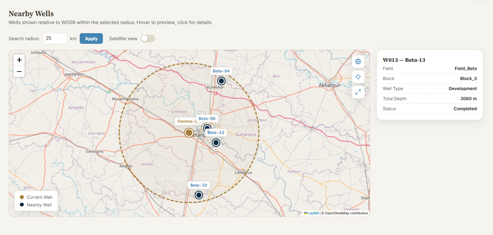
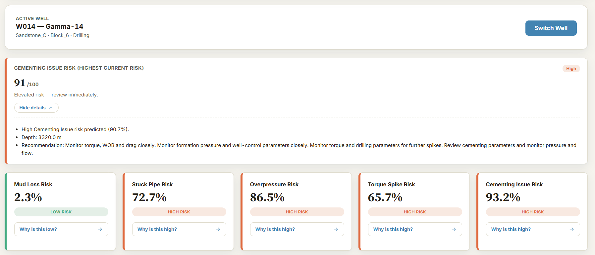
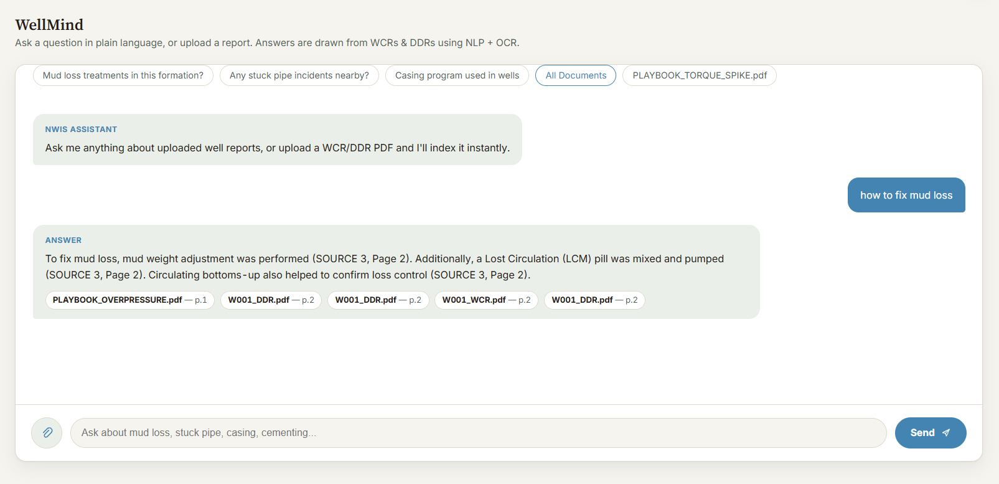
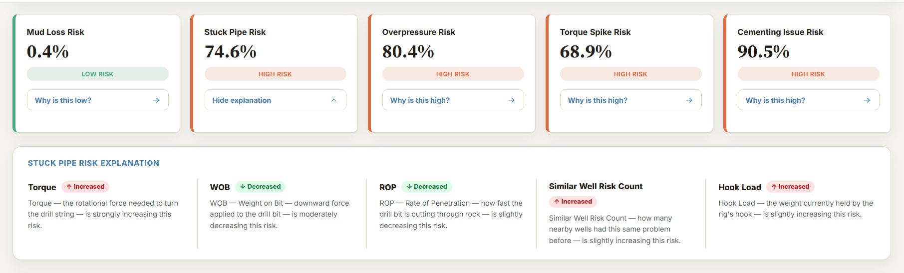
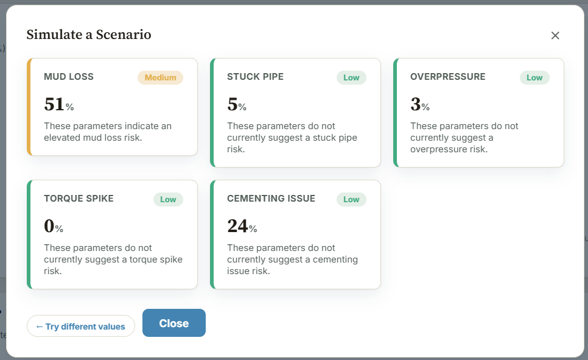
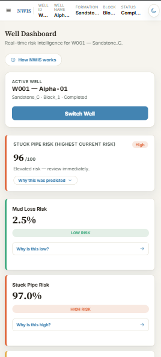
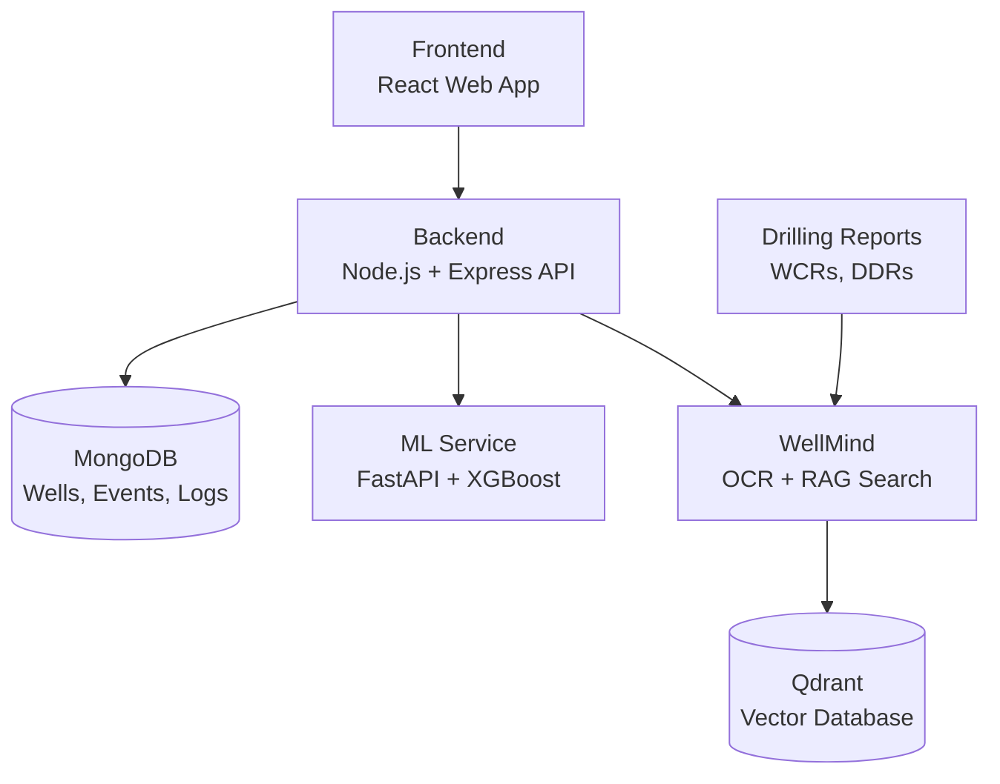

<div align="center">

# eRTMAC-NWIS
### Nearby Wells Intelligence System

**An AI-powered offset-well knowledge and decision-support platform for drilling operations**

Smart India Hackathon 2026 · Problem Statement `SIH26121` · Oil India Limited

[](https://e-rtmac-nwis.vercel.app/)

| Problem Statement ID | Team Name | Team ID |
|---|---|---|
| SIH26121 | Team DrillX | 120811 |

</div>

---

## Table of Contents

- [The Problem](#the-problem)
- [Our Solution](#our-solution)
- [Problem Statement → Feature Mapping](#problem-statement--feature-mapping)
- [Screenshots](#screenshots)
- [Model Performance](#model-performance)
- [System Architecture](#system-architecture)
- [Key Features](#key-features)
- [WellMind: RAG Pipeline](#wellmind-rag-pipeline)
- [Dataset](#dataset)
- [Security](#security)
- [Tech Stack](#tech-stack)
- [Setup & Installation](#setup--installation)
- [API Documentation](#api-documentation)
- [Repository Structure](#repository-structure)
- [Future Scope](#future-scope)
- [Team](#team)

---

## The Problem

Every well OIL drills generates Well Completion Reports, Daily Drilling
Reports, and mud logs. That archive contains the answer to almost every
problem a drilling engineer will face — which formation caused mud losses
at 2,400 m, what mud weight stopped the kick in the well 8 km east, why
the casing job failed last monsoon.

But the archive is unsearchable. It sits as thousands of scanned PDFs.
An engineer on the rig floor at 3 a.m. facing rising torque cannot read
it. The institutional memory exists and is inaccessible at the moment it
matters, so the same failures repeat across wells.

eRTMAC monitors what is happening *now*. Nothing connects it to what
already happened *before*.

---

## Our Solution

eRTMAC-NWIS is a decision-support layer that sits alongside OIL's
existing eRTMAC real-time monitoring system. It:

1. **Converts** scattered historical drilling records into a structured,
   semantically searchable knowledge base via OCR and vector embeddings.
2. **Correlates** offset wells geospatially and by formation, surfacing
   what nearby wells experienced at comparable depths.
3. **Predicts** five categories of drilling risk from live parameters,
   with SHAP explanations so an engineer sees *why* a warning fired.
4. **Alerts** proactively as the bit approaches depths and formations
   with a known incident history in nearby wells.

The result: institutional memory delivered as an answer in seconds,
instead of a manual document search that never happens.

---

## Problem Statement → Feature Mapping

| PS Requirement | Our Implementation |
|---|---|
| Display nearby wells on a geospatial map | Interactive Map (Leaflet + MongoDB geospatial queries) |
| Instant access to historical drilling experiences | WellMind — RAG knowledge assistant over WCRs/DDRs |
| Correlate drilling parameters, mud losses, kicks, stuck pipe, casing/cementing practices across wells | Similar Well Finder, Nearby Well Intelligence |
| Proactive alerts near depths/formations with known past issues | Early Warning Controller + Socket.io live push |
| AI/NLP/OCR extraction from historical reports | WellMind ingestion pipeline (OCR → chunking → embeddings) |
| Searchable knowledge repository of events and lessons learned | Qdrant vector store + engineer-submitted Decision Log |
| Predictive risk models from offset-well behaviour | Five XGBoost classifiers with SHAP explainability |
| User-friendly dashboard for field and office personnel | Role-based Office and Field interfaces |

---

## Screenshots

| Interactive Map | Risk Dashboard |
|---|---|
|  |  |

| WellMind Assistant | SHAP Explanation |
|---|---|
|  |  |

| What-If Simulator | Field View (Mobile) |
|---|---|
|  |  |

---

## Model Performance

Five independent XGBoost binary classifiers, one per risk category.

### Evaluation protocol

The dataset is split **by well, not by row** — 36 wells in training,
9 wells in test, with **zero well overlap** between the two sets.

This matters. Consecutive rows from the same well are highly correlated
(similar depth, formation, mud weight, bit). A random row-level split
would place near-duplicate records on both sides and inflate every metric
below. Splitting at the well level measures what the system actually has
to do in the field: generalise to a well it has never seen.

### Results

| Risk | Accuracy | Precision (pos) | Recall (pos) | F1 (pos) |
|---|---|---|---|---|
| Mud Loss | 0.825 | 0.767 | 0.884 | 0.821 |
| Stuck Pipe | 0.891 | 0.831 | 0.962 | 0.892 |
| Overpressure | 0.862 | 0.746 | 0.958 | 0.839 |
| Torque Spike | 0.880 | 0.803 | 0.958 | 0.873 |
| Cementing Issue | 0.868 | 0.765 | 0.965 | 0.853 |

**Dataset:** 10,876 records · 34 features · 45 wells
(8,700 train / 2,176 test)

### Why recall is prioritised over precision

Every model shows higher recall than precision on the positive class.
This is a deliberate operating-point choice, not an artefact.

In drilling, the two errors are not symmetric. A false positive costs an
engineer thirty seconds of attention. A false negative can cost a stuck
string, a lost hole section, or a well-control incident. The decision
threshold is therefore tuned to catch the event at the cost of some
false alarms — recall of 0.96 on stuck pipe means the system misses
roughly 1 event in 25, which is the number that matters operationally.

### Explainability

Every prediction is served alongside SHAP feature attributions via
`GET /api/risk/:wellId/explain`. An engineer sees not just *"stuck pipe
risk: high"* but *"driven by hole angle 62°, ROP drop, and 14 h since
last wiper trip."* A black-box alert on a rig floor gets ignored; an
explained one gets acted on.

---

## System Architecture



The Express backend is the single orchestration layer. The frontend never
talks to the ML or RAG services directly — this keeps authentication,
rate limiting, and request validation in one place, and means either
Python service can be swapped or scaled without touching the client.

A background job (`liveDepthMonitor.js`) polls the actively monitored
well every ~5 seconds, requests a risk score, and pushes a Socket.io
alert to all connected clients when a threshold is crossed.

---

## Key Features

### Intelligence

| Feature | What it does |
|---|---|
| **WellMind** | Natural-language questions answered from historical WCRs/DDRs via semantic retrieval over Qdrant |
| **Explainable Risk Prediction** | Five XGBoost models with SHAP feature attribution on every prediction |
| **Similar Well Finder** | Ranks historically comparable wells by formation sequence, depth profile, and drilling-parameter distance |
| **Nearby Well Intelligence** | Geospatial radius query returning offset wells with their event history |

### Monitoring

| Feature | What it does |
|---|---|
| **Real-Time Warnings** | Background job scores the live well continuously; Socket.io pushes alerts on threshold breach |
| **Early Warning Controller** | On-demand lookahead check — flags incidents recorded in nearby wells within the next *N* metres of planned depth |
| **Risk & Drilling Graphs** | Parameter trends, risk trajectory, and historical comparison charts |

### Decision Support

| Feature | What it does |
|---|---|
| **What-If Risk Simulator** | Adjust mud weight, ROP, WOB, RPM and see modelled risk response before committing to a parameter change |
| **Decision Log** | Engineers record problem + solution against a well, building a structured lessons-learned corpus over time |
| **Interactive Map** | Wells, risk state, and drilling intelligence on one geospatial view |

### Platform

| Feature | What it does |
|---|---|
| **Office & Field Interfaces** | Office gets full analysis and contributor tooling; Field gets a stripped, glanceable view for rig-side use |
| **Google Authentication** | Google OAuth sign-in alongside email/password, JWT-backed |
| **Continuous Learning Engine** | Simulator submissions and decision logs are persisted as labelled outcomes, forming the training corpus for scheduled model retraining |

---

## WellMind: RAG Pipeline

(Searchable Knowledge Repository + OCR + NLP + RAG)

### Ingestion

```
WCR / DDR / mud log PDF
        │
        ▼
   ocr.py            → extracts raw text from scanned and digital PDFs
        │
        ▼
 text_processor.py   → cleans artefacts, segments into overlapping chunks
        │
        ▼
  embeddings.py      → encodes chunks into dense vectors
        │
        ▼
 qdrant_store.py     → upserts vectors + metadata (well ID, depth, doc type)
        │
        ▼
     Qdrant          ← ingest.py (single) | bulk_ingest.py (batch)
```

### Retrieval

```
Engineer query  →  retrieve.py  →  top-k chunks by cosine similarity
                                            │
                                            ▼
                                   generate_answer.py
                                            │
                                            ▼
                          Grounded answer + source citations
```

### Configuration

| Parameter | Value |
|---|---|
| OCR engine | PaddleOCR with PyMuPDF text extraction fallback |
| Embedding model | `sentence-transformers/all-MiniLM-L6-v2` (384-dim) |
| Chunk size / overlap | 512 tokens / 64-token overlap |
| Retrieval | Cosine similarity, top-k = 5 |
| Generation model | `meta-llama/Llama-3.1-8B-Instruct` via Hugging Face Inference API |
| Documents indexed | Add actual indexed document count |

Answers are constrained to retrieved context and return the source
document and page, so an engineer can verify against the original report
rather than trusting a generated summary.

**Example query:** *"Were mud losses seen near 2,400 m in nearby wells?"*
→ retrieves the relevant WCR passages across offset wells and returns a
synthesised answer with per-well citations.

---

## Dataset

Oil India Limited provided no public dataset for this problem statement.
The risk models are therefore trained on a **synthetically generated
dataset**, constructed to reflect realistic drilling parameter ranges,
formation behaviour, and the risk patterns described in the problem
statement and in public drilling-engineering literature.

| | |
|---|---|
| **File** | [`NWIS_drilling_data.csv`](./ml-service/datasets/NWIS_drilling_data.csv) |
| **Type** | Synthetic |
| **Size** | 10,876 records across 45 wells |
| **Features** | 34 (32 numeric, 2 categorical: `Formation`, `Bit_Type`) |
| **Targets** | 5 binary labels — mud loss, stuck pipe, overpressure, torque spike, cementing issue |

**What this dataset does and does not demonstrate.** It validates that the
feature schema, training pipeline, inference service, and SHAP
explainability layer function end to end on realistic data shapes. It is
**not** evidence of real-world predictive accuracy. In production this
file is replaced by actual WCR, DDR, and eRTMAC historical records, and
the models are retrained and revalidated against them before any
operational use.

---

## Security

NWIS follows a security-first approach for protecting drilling data, user accounts, and API access.

### Authentication & Authorization
- JWT-based authentication
- Google OAuth login
- Role-based authorization (Office and Field roles)

### API Security
- CORS restricted to approved frontend origins
- Invalid/missing auth tokens rejected
- No sensitive credentials or internal errors exposed in responses

### Database Security
- MongoDB credentials stored in environment variables (not source code)
- Passwords hashed before storage — never stored in plain text

## Tech Stack

| Layer | Technology |
|---|---|
| **Frontend** | React, Vite, Leaflet, Socket.io client |
| **Backend** | Node.js, Express, MongoDB (Mongoose), Socket.io, JWT |
| **ML Service** | Python, FastAPI, XGBoost, SHAP, scikit-learn, pandas |
| **WellMind** | Python, FastAPI, Qdrant, sentence-transformers, OCR |
| **Auth** | Google OAuth 2.0 + JWT |


---

## Setup & Installation

### Prerequisites

- Node.js 18+
- Python 3.10+
- MongoDB (local or Atlas)
- Qdrant (local Docker or Qdrant Cloud)
- Google OAuth credentials

Four services must run concurrently. Use four terminals.

### 1. Clone

```bash
git clone https://github.com/<your-org>/eRTMAC-NWIS.git
cd eRTMAC-NWIS
```

### 2. Backend — port 5000

```bash
cd backend
npm install
```

Create `backend/.env`:

```env
MONGODB_URI=your_mongodb_connection_string
GOOGLE_CLIENT_ID=your_google_client_id
JWT_SECRET=your_jwt_secret
PORT=5000
ML_PREDICT_URL=http://localhost:8000/predict
ML_EXPLAIN_URL=http://localhost:8000/explain
ML_REALTIME_WARNING_URL=http://localhost:8000/realtime-warning
WELLMIND_URL=http://localhost:8001

```

Seed the database, then start:

```bash
npm run seed      # loads sample wells, events, formations
npm run dev
```

### 3. ML Service — port 8000

```bash
cd ml-service
pip install -r requirements.txt
```

Train the models (or use the committed `.pkl` files):

```bash
python train_model.py
```

Start the service:

```bash
uvicorn app:app --reload --port 8000
```

Create `ml-service/.env`:
MONGO_URI=your_mongo_uri
DB_NAME=your_db_name

### 4. WellMind — port 8001

```bash
cd wellmind
pip install -r requirements.txt
```

Create `wellmind/.env`:

```env
QDRANT_URL=your_qdrant_url
QDRANT_API_KEY=your_qdrant_api_key
QDRANT_COLLECTION=your_qdrant_collection_name
HF_TOKEN=your_hf_token
```

Ingest the knowledge repository, then start:

```bash
python rag/bulk_ingest.py
uvicorn app:app --reload --port 8001
```

### 5. Frontend — port 3000

```bash
cd frontend
npm install
```

Create `frontend/.env`:

```env
VITE_API_URL=http://localhost:5000
VITE_GOOGLE_CLIENT_ID=your_google_client_id
VITE_SOCKET_URL=http://localhost:5000
```

```bash
npm run dev
```

Open **http://localhost:3000**

---

## API Documentation

All backend routes except `/api/auth/*` require a
`Authorization: Bearer <jwt>` header.

### Backend — Authentication

| Method | Endpoint | Description |
|---|---|---|
| `POST` | `/api/auth/register` | Register with email + password |
| `POST` | `/api/auth/login` | Log in with email + password |
| `POST` | `/api/auth/google` | Sign in / sign up via Google OAuth |

### Backend — Risk Prediction

| Method | Endpoint | Description |
|---|---|---|
| `GET` | `/api/risk/:wellId` | Current risk prediction for a well |
| `GET` | `/api/risk/:wellId/explain` | SHAP explanation behind the prediction |

### Backend — Realtime Warning with Recommendation

| Method | Endpoint | Description |
|---|---|---|
| `GET` | `/api/realtime-warning/:wellId?radius=20&lookahead=100` | Lookahead check against incidents in wells within `radius` km, over the next `lookahead` m |

**Live alerts (Socket.io).** `liveDepthMonitor.js` polls the monitored
well every ~5 seconds and emits to all connected clients on threshold
breach. No polling required from the client.

```js
socket.on("risk-alert", (payload) => {
  // { wellId, riskType, probability, depth, timestamp }
});
```

### Backend — Wells

| Method | Endpoint | Description |
|---|---|---|
| `GET` | `/api/wells/nearby?lat=26.11&lng=82.66&radius=20` | Wells within `radius` km of a coordinate |
| `GET` | `/api/wells/search?q=W00` | Partial `wellId` search, case-insensitive |
| `GET` | `/api/wells/:wellId` | Full raw details for one well |
| `GET` | `/api/wells/:wellId/full` | Well details + decision log (map popup) |
| `GET` | `/api/wells/similar/:wellId?limit=5` | Top-N historically similar wells |
| `POST` | `/api/wells` | Create a well |

### Backend — Events & Decision Log

| Method | Endpoint | Description |
|---|---|---|
| `GET` | `/api/wells/:wellId/events` | Past incident events for a well |
| `POST` | `/api/wells/:wellId/events` | Record a new event |
| `GET` | `/api/wells/:wellId/decision-logs` | All decision-log entries for a well |
| `POST` | `/api/wells/:wellId/decision-logs` | Submit an engineer's problem + solution |
| `GET` | `/api/wells/:wellId/contributors` | Contributors list (office role only) |

### ML Service (port 8000)

| Method | Endpoint | Description |
|---|---|---|
| `POST` | `/predict` | Predict all five risks from drilling parameters |
| `POST` | `/explain` | SHAP attributions for a prediction |
| `POST` | `/realtime-warning` | Score live sensor data against alert thresholds |
| `POST` | `/retrain` | Retrain models on accumulated logged outcomes |
| `GET` | `/retrain/status` | Status of a running retraining job |
| `POST` | `/upload` | Upload a dataset or log file for processing |

**`POST /predict`**

```jsonc
// Request
{
  "Depth": 2450.0,
  "Mud_Weight": 1.32,
  "ROP": 12.4,
  "WOB": 18.2,
  "RPM": 120,
  "Formation": "Barail",
  "Bit_Type": "PDC"
  // ... remaining features per feature_columns.pkl
}

// Response
{
  "predictions": {
    "Mud_Loss":        { "risk": 0, "probability": 0.21 },
    "Stuck_Pipe":      { "risk": 1, "probability": 0.78 },
    "Overpressure":    { "risk": 0, "probability": 0.14 },
    "Torque_Spike":    { "risk": 1, "probability": 0.66 },
    "Cementing_Issue": { "risk": 0, "probability": 0.09 }
  }
}
```

**`POST /explain`**

```jsonc
// Response
{
  "risk_type": "Stuck_Pipe",
  "probability": 0.78,
  "base_value": 0.46,
  "top_features": [
    { "feature": "Hole_Angle",        "value": 62.0, "shap": 0.18 },
    { "feature": "Hours_Since_Trip",  "value": 14.0, "shap": 0.11 },
    { "feature": "ROP",               "value": 12.4, "shap": -0.04 }
  ]
}
```

### WellMind Service (port 8001) 

| Method | Endpoint | Description |
|---|---|---|
| `POST` | `/ask` | Natural-language question against the knowledge repository |

```jsonc
// Request
{ "query": "Were mud losses seen near 2400m in nearby wells?",
  "well_id": "W0012", "top_k": 5 }

// Response
{
  "answer": "Two offset wells recorded mud losses in this interval ...",
  "sources": [
    { "well_id": "W0008", "document": "WCR_W0008.pdf",
      "page": 14, "score": 0.87 }
  ]
}
```

---

## Repository Structure

```text
eRTMAC-NWIS/
│
├── backend/                            # Express orchestration layer
│   ├── controllers/                    # Route handlers (auth, risk, wells, wellmind, …)
│   ├── models/                         # Mongoose schemas
│   │   ├── Alert.js                    # Risk alerts
│   │   ├── DecisionLog.js              # Engineer problem + solution entries
│   │   ├── Document.js                 # Document metadata
│   │   ├── DrillingData.js             # Drilling parameter records
│   │   ├── Employee.js                 # Users and roles
│   │   ├── Event.js                    # Historical incidents
│   │   ├── Formation.js                # Geological formations
│   │   ├── ScenarioSubmission.js       # What-if simulator submissions
│   │   ├── Well.js                     # Well master record
│   │   └── WellDocument.js             # Well ↔ document linkage
│   ├── routes/                         # API route definitions
│   ├── middleware/                     # Auth, validation, error handling
│   ├── jobs/
│   │   └── liveDepthMonitor.js         # Polls live well, emits Socket.io alerts
│   ├── utils/                          # Shared helpers
│   ├── data/                           # Seed data
│   └── server.js                       # Entry point
│
├── frontend/                           # React + Vite client
│   ├── public/                         # Static assets served as-is
│   ├── src/
│   │   ├── api/                        # Backend service modules
│   │   ├── assets/                     # Images and icons
│   │   ├── components/                 # Reusable UI components
│   │   ├── context/                    # Auth, theme, role, wells, notifications
│   │   ├── layouts/                    # Shared page layouts
│   │   ├── pages/                      # Application screens
│   │   ├── utils/                      # Helper logic
│   │   ├── App.jsx                     # Root component and routing
│   │   ├── index.css                   # Global styles
│   │   └── main.jsx                    # React entry point
│   └── index.html                      # Vite HTML entry
│
├── ml-service/                         # Risk prediction (FastAPI)
│   ├── datasets/
│   │   └── NWIS_drilling_data.csv      # Training dataset
│   ├── train_model.py                  # Well-level split, training, evaluation
│   ├── prediction.py                   # Inference + SHAP explanation
│   ├── app.py                          # FastAPI entry point
│   ├── drilling_risk_models.pkl        # Five serialized XGBoost models
│   ├── shap_explainers.pkl             # Serialized SHAP explainers
│   ├── feature_columns.pkl             # Feature schema
│   ├── categorical_columns.pkl         # Categorical reference
│   └── reference_dtypes.pkl            # Input dtype validation schema
│
├── wellmind/                           # RAG knowledge assistant (FastAPI)
│   ├── knowledge_repository/           # WCR, DDR, mud log source documents
│   ├── rag/
│   │   ├── ocr.py                      # PDF → text extraction
│   │   ├── text_processor.py           # Cleaning and chunking
│   │   ├── embeddings.py               # Chunk → vector encoding
│   │   ├── qdrant_store.py             # Vector store interface
│   │   ├── ingest.py                   # Single-document ingestion
│   │   ├── bulk_ingest.py              # Batch ingestion
│   │   ├── retrieve.py                 # Semantic retrieval
│   │   └── generate_answer.py          # Grounded answer synthesis
│   ├── app.py                          # FastAPI entry point
│   └── requirements.txt
│
├── docs/
│   └── screenshots/                    # README images
│
└── README.md
```

---

## Future Scope

- Integrate directly with eRTMAC's live data streams for real-time correlation instead of periodic sync.
- Expand the knowledge repository ingestion pipeline to handle scanned/handwritten legacy reports with improved OCR accuracy.
- Add multi-well trajectory visualization in 3D for complex directional wells.
- Extend predictive models with time-series depth-based risk forecasting.

---

## Team

**Team DrillX** · Team ID `120811`

| Name | Role |
|---|---|
| Vidhi Singh | Team Lead, Backend Development |
| Yashvi Singh | ML / Risk Prediction, WellMind RAG Pipeline |
| Palak Bhati | Frontend Development |
| Deepanjali Pathak | Research & Presentation |
| Aleena Fatima Khan | Research & Presentation |
| Bhavna Sahu | Research & Presentation |

---

<div align="center">

Built for Smart India Hackathon 2026 · Problem Statement SIH26121

</div>
